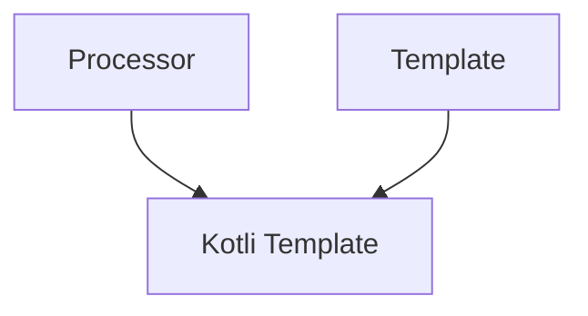

Each **Kotli Template** is a self-contained Kotlin artifact that encompasses all the necessary metadata for presentation and facilitates the multistep process of generating an output structure.

It comprises `Template` and `Processor`

## Template

It serves as the initial blueprint for a project template structure without any limitations.
The structure can be written in any language, and technically, it doesn't even have to be a "project".
The crucial aspect is that this template is utilized by the `Processor` to generate the resulting structure.

:::tip
It is recommended for this structure to be a functional example of a project, importable into an IDE as-is for testing and modification purposes.
:::

## Processor

The initial blueprint template can include many dependencies and implement a ton of functionality, which usually is not needed by everyone.

The `Processor` serves two goals:

1. Include only the required features into the output structure.
2. Provide any third-party solution that utilizes the artifact with all the required metadata describing the `processor`.

## Examples

Before delving deep into the details, it is recommended to check how existing templates look. Here are some examples:

1. Android Compose Application - https://github.com/kotlitecture/template-android-compose
2. Spring Boot Application - https://github.com/kotlitecture/template-backend-spring-boot 