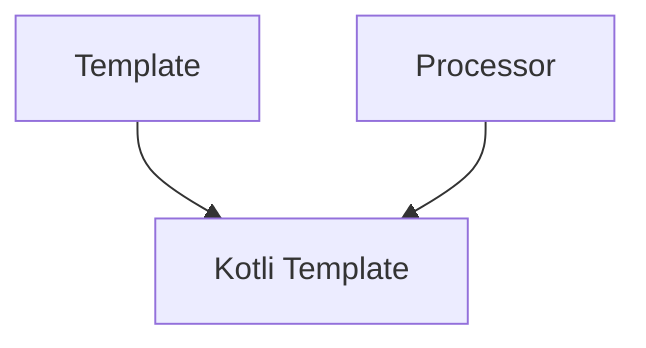
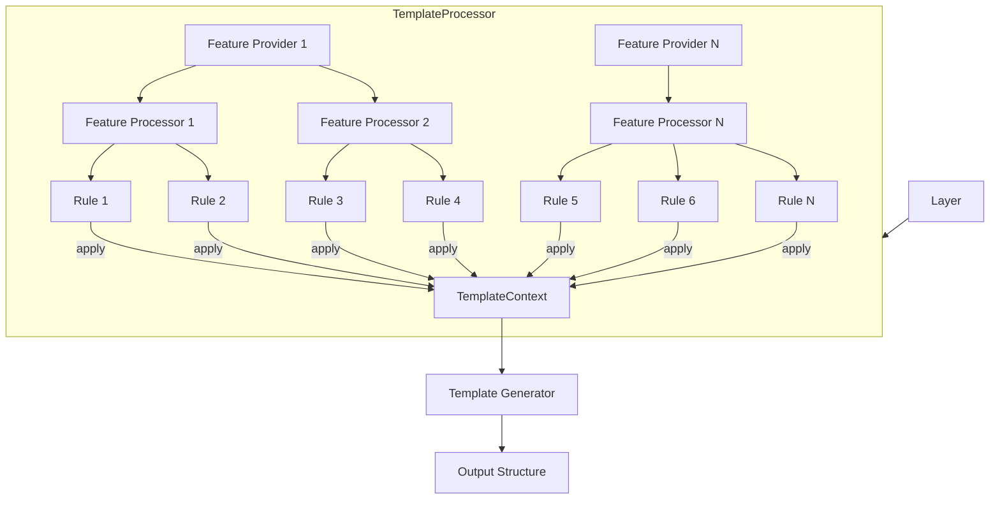

Each **Kotli Template** is a self-contained Kotlin artifact that encompasses all the necessary metadata for presentation and facilitates the multistep process of generating an output structure.

It comprises `Template` and `Processor`.



## Template

It serves as the initial blueprint for a project template structure without any limitations.
The structure can be written in any language, and technically, it doesn't even have to be a "project".
The crucial aspect is that this template is utilized by the `Processor` to generate the resulting structure.

:::tip[&nbsp;]
It is recommended for this structure to be a functional example of a project, importable into an IDE as-is for testing and modification purposes.
:::

## Processor

The initial blueprint template can include many dependencies and implement a ton of functionality, which usually is not needed by everyone.

The `Processor` serves two goals:

1. Include only the required features into the output structure.
2. Provide any third-party solution that utilizes the artifact with all the required metadata describing the `processor`.

Let's take a look at some existing `processors` for a better understanding of the whole mechanics.

Any external usage of the `Kotli Template` occurs through its processor only.



### 1. Template Processor

A typical processor is an implementation of the `BaseFeatureProcessor` class.

```kotlin
class AndroidComposeTemplateProcessor : BaseTemplateProcessor() {

    override fun getId(): String = "template-android-compose"
    override fun getType(): LayerType = LayerTypes.Android
    override fun getWebUrl(): String = "https://github.com/kotlitecture/template-android-compose"

    override fun createProviders(): List<FeatureProvider> = listOf(
        L10NProvider(),
        NavigationProvider(),
        SplashProvider(),
        ThemeProvider(),
        ...
    }
    
    override fun processBefore(state: TemplateState) {
        state.onApplyRules(
            "app/build.gradle",
            ReplaceMarkedText(
                text = "kotli.app",
                marker = "{applicationId}",
                replacer = state.layer.namespace,
                singleLine = true
            )
        )
        ...
    }

}
```

Each implementation is responsible for overriding the given methods:

- `getId()` - Defines the unique processor id. This id must be unique across all registered processors in the classpath.
- `getType()` - Clarifies the type of the template and is used for a better understanding of its purpose.
- `getWebUrl()` - Mostly an URL to the repository with the source codes of the template implementation. Although it's not required to link source codes, we prioritize open-source and its collaborative possibilities.
- `createProviders()` - This is the main method. It registers all providers responsible for manipulating the blueprint template to form the required output architecture.
- `processBefore()` - Used to apply some `rules` to the output structure before it is delegated to providers.

### 2. Feature Provider

Feature providers are used to group different implementations of the same functionality by different vendors.

Examples:
- Your project requires the use of analytics events, and you want to log such events into one or multiple different services (Google Analytics, Amplitude, AppsFlyer).
- Your project requires publication in different distribution channels (Maven, Google Artifact Registry, AWS CodeArtifact, etc.).

In both scenarios, you can use either one or multiple services (`processors`). Depending on the scenario, you will get all the required technical solutions to either log events into multiple systems using one common method or deploy artifacts into several destinations using one generated pipeline.

:::tip[&nbsp;]
Feature Provider is responsible to group multiple similar services, present them to the user, and generate all required artifacts, making it possible to operate with the services as one.
:::

A typical feature provider is an implementation of the `BaseFeatureProvider` class.

```kotlin
class DistributionProvider : BaseFeatureProvider() {

    override fun getId(): String = ID
    override fun isMultiple(): Boolean = true
    override fun getType(): FeatureType = FeatureTypes.DevOps

    override fun createProcessors(): List<FeatureProcessor> = listOf(
        FirebaseDistributionProcessor(),
        GooglePlayDistributionProcessor()
    )

    companion object {
        const val ID = "distribution"
    }
}
```

Each implementation is responsible for overriding the given methods:

- `getId` - Unique identifier of the provider. It must be unique only across other providers of the `template processor` it is registered in.
- `isMultiple` - Instructs the `Template Processor` if it is possible to use several `feature processors` in the output structure.
- `getType` - Clarifies the type of the provider for a better understanding of its purpose.
- `createProcessors` - Registers all `feature processors` of the given provider.

### 3. Feature Processor

The `Feature Processor` is responsible for the inclusion or exclusion of the feature it implements in the generated template.
A `feature` is any atomic integration, technical solution, or business flow that can be added to a layer during its configuration in `Kotli`.
Each feature should be self-descriptive, allowing it to be presented to the user with an `icon`, `title`, `description`, `links`, and any `other metadata` required to understand its value and purpose.
The primary advantage of a feature is to provide a ready-to-use solution with minimal configuration required (zero configuration is the goal).

A typical feature processor is an implementation of the `BaseFeatureProcessor` class.

```kotlin
class FirebaseDistributionProcessor : BaseFeatureProcessor() {

    override fun getId(): String = ID
    override fun getWebUrl(state: TemplateState): String = "https://firebase.google.com/docs/app-distribution"
    override fun getIntegrationUrl(state: TemplateState): String = "https://firebase.google.com/docs/app-distribution/android/distribute-gradle"

    override fun dependencies(): List<Class<out FeatureProcessor>> = listOf(
        GoogleServicesProcessor::class.java,
        FirebaseProcessor::class.java
    )

    override fun doApply(state: TemplateState) {
        state.onApplyRules("app/build.gradle",
            CleanupMarkedLine("{firebase-distribution}"),
            CleanupMarkedBlock("{firebase-distribution-debug}"),
            CleanupMarkedBlock("{firebase-distribution-staging}")
        )
        ...
    }

    override fun doRemove(state: TemplateState) {
        state.onApplyRules("app/build.gradle",
            RemoveMarkedLine("{firebase-distribution}"),
            RemoveMarkedBlock("{firebase-distribution-debug}"),
            RemoveMarkedBlock("{firebase-distribution-staging}")
        )
        ...
    }

    companion object {
        const val ID = "firebase-distribution"
    }

}
```

Each implementation is responsible for overriding the given methods:

- `getId` - Unique identifier of the processor. It must be unique only across other processors of the `template processor` it is used in.
- `getWebUrl` - Any official URL of the underlying functionality for a better understanding of its purpose by the user.
- `getIntegrationUrl` - Any public URL of the integration guide for this feature. This guide is not required when the feature is included. Instead, it is just a knowledge base of the sources used to integrate the feature.
- `dependencies` - If the feature has any dependencies on other features, the processor will apply them first to the prepared structure. The dependencies must also be registered in the `template processor` through `feature providers`.
- `doApply` - When the feature is selected by the user, this method is used to apply some `rules` to the files affected by the feature in the blueprint template. It is not required that such files exist in the original template.
- `doRemove` - When the feature is not selected by the user, this method will be called to `cleanup` the template from any changes specific to the feature only.

### 4. File Rule

Any rule to be applied to a file from the blueprint template during the generation of the output structure.

:::info[&nbsp;]
It is not required that file exists in the original template.
:::

A typical rule is an implementation of the `FileRule` class.

```kotlin
class CleanupMarkedLine(
    private val marker: String,
    private val singleLine: Boolean = false
) : FileRule() {

    override fun doApply(file: TemplateFile) {
        val lines = file.lines
        lines.forEachIndexed { index, line ->
            if (isMarked(file, line, marker)) {
                lines[index] = cleanup(file, line)
                if (singleLine) return
            }
        }
    }

}
```

Each file rule requires implementing only one method, `doApply`. This method is called during the final stage of the generation phase.

:::tip[&nbsp;]
**File Rule** is not bound to a file it modifies.
:::

:::info[&nbsp;]
It is possible to implement any rule with any underlying template engine to process the input file.
:::

:::warning[&nbsp;]
The engine allows applying different rules to the same file. In such cases, each subsequent rule will operate with the modified version of the file.
:::

## Examples

It is recommended to check how existing templates look for a better understanding of the engine concept. Here are some examples:

1. Android Compose Application - https://github.com/kotlitecture/template-android-compose
2. Spring Boot Application - https://github.com/kotlitecture/template-backend-spring-boot 
